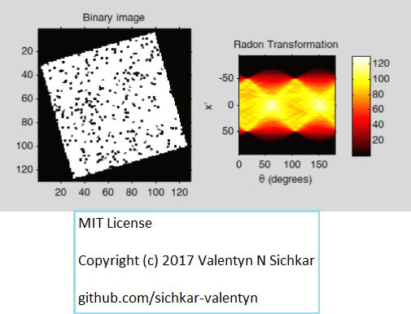

# Radon Transformation Matlab
Radon Transformations in Matlab

### Reference to:
[1] Valentyn N Sichkar. Radon Transformations in Matlab // GitHub platform [Electronic resource]. URL: https://github.com/sichkar-valentyn/Radon_Transformation_Matlab (date of access: XX.XX.XXXX)

## Description
In this study we’re going to learn what the Radon transformation is and how to use it in Matlab. We’re going to work with two images – first is with lines and second is with rectangle.

## Radon Transformation with lines

## Radon Transformation of the binary image with lines

## Finding the strong peaks in the Radon transform matrix

## Radon transformation of the binary image with rectangle

## Finding the strong peaks in the Radon transform matrix of rectangle

## MIT License
## Copyright (c) 2017 Valentyn N Sichkar
## github.com/sichkar-valentyn
### Reference to:
[1] Valentyn N Sichkar. Radon Transformations in Matlab // GitHub platform [Electronic resource]. URL: https://github.com/sichkar-valentyn/Radon_Transformation_Matlab (date of access: XX.XX.XXXX)
